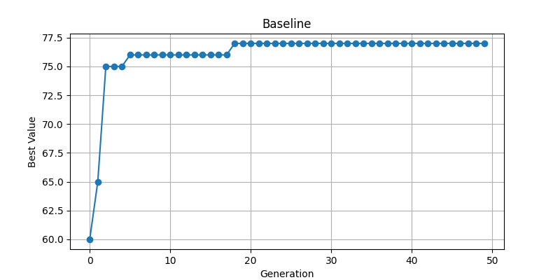

# Assignment 2 — Genetic Algorithm: Knapsack Problem
## Observation Report

Student Name  : ___________sri nandhini________________  
Student ID    : ____________2310040045_______________  
Date Submitted: ________25/3/2026___________________  

---

## How to Submit

1. Run each experiment following the instructions below
2. Fill in every answer box — do not leave placeholders
3. Make sure the plots/ folder contains all required images
4. Commit this README and the plots/ folder to your GitHub repo

---

## Before You Begin — Read the Code

Open ga_knapsack.py and read through it. Then answer these questions.

Q1. What does the `fitness()` function return? Why does an overweight solution score 0?

The fitness() function calculates the total value of the items selected in the chromosome. 
It first computes the total weight and total value of the packed items. 
If the total weight exceeds the maximum allowed weight (15 kg), the function returns 0 because the solution is invalid and cannot be used in the knapsack.

Q2. What does `tournament_select()` do? Why are higher-fitness individuals more likely to be chosen?

The tournament_select() function randomly selects a small group of individuals from the population and chooses the one with the highest fitness. 
Since the individual with the best fitness in that group wins the tournament, better solutions have a higher chance of being selected. 
This helps the algorithm gradually improve the population by favoring stronger individuals.

Q3. Look at the `run_ga()` loop. Find this line:
next_gen = [best_chromosome[:]]
What is this doing? Why is it important to always keep the best solution?

This line copies the best chromosome from the current generation into the next generation. 
This technique is called elitism and ensures that the best solution found so far is not lost during crossover or mutation. 
Keeping the best individual helps the genetic algorithm maintain progress and improve results over generations.

---

## Experiment 1 — Baseline Run

Instructions: Run the program without changing anything.
python ga_knapsack.py

Fill in this table:

| Metric | Your result |
|--------|-------------|
| Number of generations |50 |
| Best value at generation 1 | 60|
| Final best value |77 |
| Total weight of best solution (kg) |14.4 |
| Is solution valid (Yes / No) |Yes |

Copy the printed packing list here:
**Experiment 1 Graph**

Look at `plots/experiment_1.png` and describe what you see (2–3 sentences).  
*Where does the biggest improvement happen? Does the curve flatten at some point?*
The graph shows that the best value improves quickly in the early generations. 
Most improvement happens in the first few generations as the algorithm discovers better combinations of items. 
After reaching a value around 77, the curve becomes flat, indicating the algorithm has converged to a stable optimal solution.

---

## Experiment 2 — Effect of Mutation Rate

Instructions: In ga_knapsack.py, find the # EXPERIMENT 2 block in __main__.  
Copy it three times and run with mutation_rate = 0.01, 0.05, and 0.30.  
Save plots as experiment_2a.png, experiment_2b.png, experiment_2c.png.

Results table:

| mutation_rate | Final best value | Weight (kg) | Valid? | Shape of curve |
|--------------|-----------------|-------------|--------|----------------|
| 0.01         |          75     |       14.9  |   YES  |  Slow improvement, early plateau              |
| 0.05         |          77     |       14.4  |   YES  | Smooth improvement, stable convergence        |
| 0.30         |          78     |       14.1  |   YES  | More fluctuations but eventually highest value|